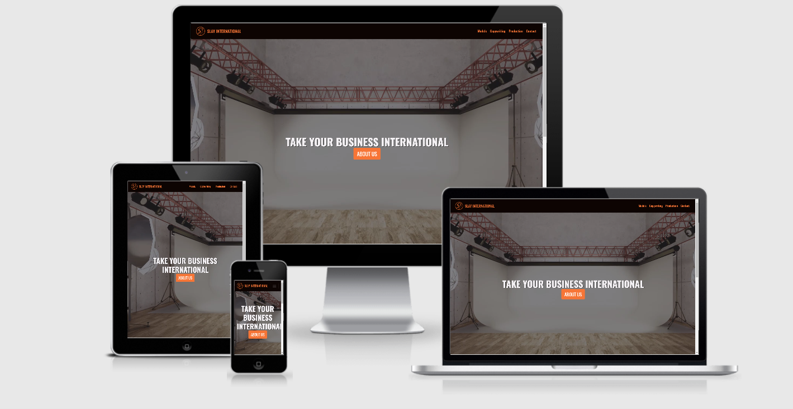
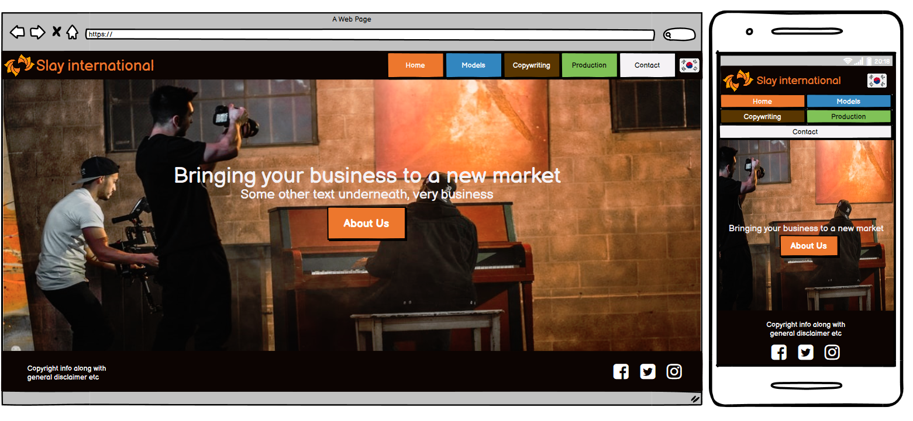
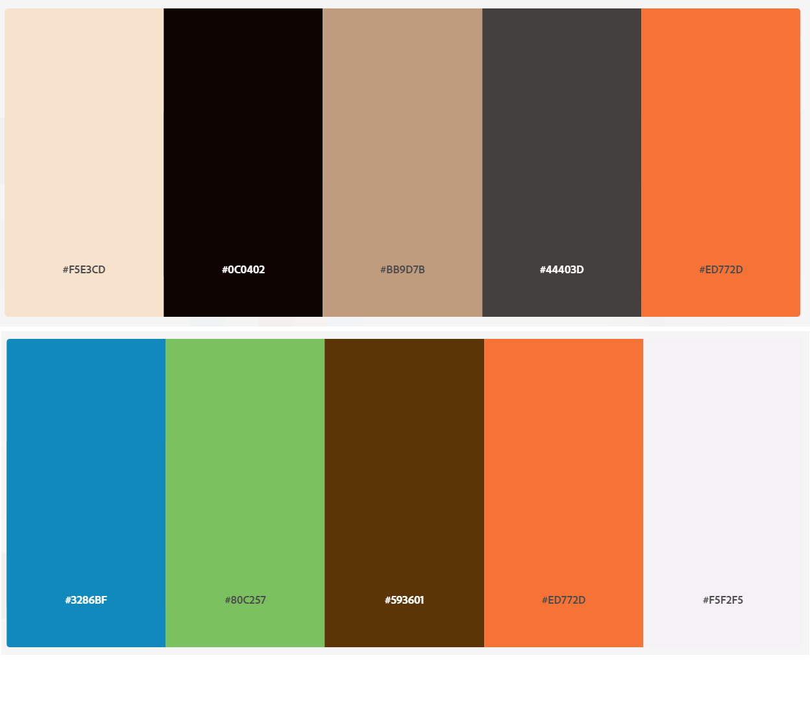
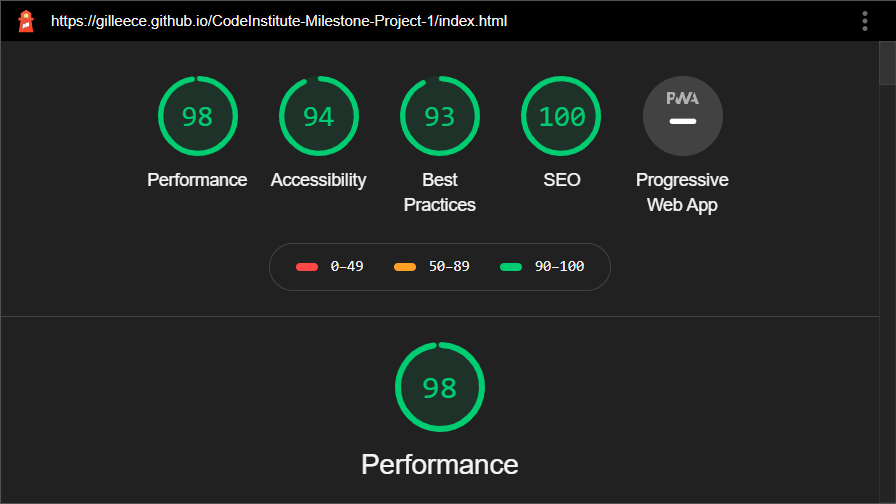

# Slay International Website

[Live link](https://gilleece.github.io/CodeInstitute-Milestone-Project-1/)

[GitHub Repository](https://github.com/Gilleece/CodeInstitute-Milestone-Project-1)



This website is designed to be the primary online presence for a start-up called "Slay International". This Korean based company is focused on 3 primary services: an international model and talent agency for the Korean market, copywriting/translation (English -> Korean and vice versa), and production service for promotional materials such as video advertising. In making this website I strive to coherently present these options to potential customers and ensure that the website quickly and efficiently leads them to the information they require while maintaining an appealing and professional image for the company. The site is built as my first Milestone project during my study at Code Institute, with the focus being on HTML/CSS. The site utilizes bootstrap as a core component.
 
# Table of contents
1. [UX](#UX)
    1. [First Time Visitor Goals](#firsttime)
    2. [Returning Visitor Goals](#returning)
2. [Features](#features)
    1. [Existing Features](#existing)
    2. [Future Features](#future)
3. [Technologies Used](#tech)
4. [Testing](#testing)
    1. [Manual Testing](#manual)
    2. [Automatic Testing](#auto)
5. [Deployment](#deployment)
    1. [Github Pages](#pages)
    2. [Making A Local Clone](#local)
6. [Credits](#credits)
6. [Media](#Media)

## UX <a name="UX"></a>

In terms of the site's UI, the goal is to coherently present the services provided to potential customers and ensure that the website quickly and efficiently leads them to the information they require.

Here are the 2 initial wireframes that I made, using Balsamiq. The site's design changed somewhat (specifically the navbar) during production but the foundational layout remains.




Here are the 2 colour schemes that the site is based upon:



The primary visitor of this website will be customers wishing to avail of one of the 3 services available, secondary visitors would be models that wish to be promoted through the company.

The site will feature a homepage, with a brief overview/introduction and then 4 main sections. 1 for each service and the final 4th section as a contact page.

### First Time Visitor Goals: <a name="firsttime"></a>
- As a first time visitor I need to be able to navigate the site easily and clearly understand the services provided.
- As a first time visitor wishing to avail of the modelling service, I need to see a selection of models and a means of contacting the business.
- As a first time visitor wishing to avail of copywriting or production services, I need to see data as to why I should choose this company and a means of contacting the business.

### Returning Visitor Goals: <a name="returning"></a>
- As a returning user, I want to see an updated gallery of the currently available models.
- As a returning user, interested in the production service, I want to be able to see a video of some of the latest work.

## Features <a name="features"></a>

There are 5 sections: Home, models, copywriting, production, contact.
Home, copywriting and production have text and images to display relevant information to the user.
Models page has a gallery that displays an image of each model, and their name underneath.
The contact page has a simple contact form for clients to reach out to the business.
 
### Existing Features <a name="existing"></a>
- Responsive design
- Gallery 
- Video hero section 
- Social links 
- Embedded video for example of work 
- Contact form (currently non-functional)

### Future Features <a name="future"></a>
- The website will require a Korean version
- The contact form needs to be made functional

## Technologies Used <a name="tech"></a>

1. [HTML:](https://www.w3.org/html/)
    - HTML was used for the content and structure of the site, with emphasis placed on semantic elements and text alternatives for screen readers.
1. [CSS:](https://www.w3.org/Style/CSS/)
    - Bootstrap was used to assist with the responsiveness and styling of the website.
1. [Bootstrap 4.5.2:](https://getbootstrap.com/docs/4.4/getting-started/introduction/)
    - Bootstrap was used to assist with the responsiveness and styling of the website.
1. [Google Fonts:](https://fonts.google.com/)
    - Google fonts were used to import the 'Oswald' and "EB Garamond" font into the style.css file which is used on all pages throughout the project.
1. [Font Awesome:](https://fontawesome.com/)
    - Font Awesome was used on all pages throughout the website to add icons for aesthetic and UX purposes.
1. [jQuery:](https://jquery.com/)
    - jQuery came with Bootstrap to make the navbar responsive.
1. [Git](https://git-scm.com/)
    - Git was used for version control by utilizing the Gitpod terminal to commit to Git and Push to GitHub.
1. [GitHub:](https://github.com/)
    - GitHub is used to store the projects code after being pushed from Git.
1. [GIMP:](https://www.gimp.org/)
    - GIMP was used to create the logo, resizing images and editing photos for the website.
1. [Vegas Pro:](https://www.vegascreativesoftware.com/ie/vegas-pro/)
    - Vegas Pro was used to edit the video in the hero image.
1. [Balsamiq:](https://balsamiq.com/)
    - Balsamiq was used to create the wireframes during the design process.


## Testing <a name="testing"></a>

Testing was carried out both manually and automatically. 

### Manual Testing: <a name="manual"></a>

While building the site I had a preview open in my browser that I would check
after most changes to ensure that the results were as intended. I made use of developer tools within the browser constantly to check
across a number of things, in particular the responsiveness of the site.

My manual testing process was as follows.

#### For each page I performed the following checks:
    * Desktop
        - Make sure content loads properly, and timely
        - No errors
        - Make sure buttons work correctly
        - Make sure social links work correctly
    * Mobile
        - Repeat above tests
        - Try common gestures like pinch to zoom, rotating orientation
        - Test the toggle menu

    All tests were performed across multiple browsers and OS.
        
#### For index.html I performed the following additional checks:
        - Make sure call to action works
        - Check animations of cards and their buttons
 
#### For models.html I performed the following additional checks:
        - Make sure gallery images load correctly
        - Check animations of the cards
        - Make sure the correct navbar button is displaying as active  

#### For copywriting.html I performed the following additional checks:
        - Make sure cards and main image load correctly
        - Make sure the correct navbar button is displaying as active

#### For production.html I performed the following additional checks:
        - Make sure cards and main image load correctly
        - Make sure the correct navbar button is displaying as active   
        - Make sure the embedded youtube video is loading and formatted correctly

#### For contact.html I performed the following additional checks:
        - Make sure the form is loading and formatted correctly
        - Make sure the correct navbar button is displaying as active     


As an example of how I fixed an issue, I would sometimes find that text would not stay within a card, or would be misaligned. I would then
use developer tools to check on that specific element's padding, margin etc and what other parts of the site were affecting it. Through developer
tools I could quickly and easily test numerous fixes and upon finding one that worked I would take it into my code and then test again once it
was actually present in my code. This consistent and rigourous testing allowed for me to stay ontop of each section of the site, as I built it, 
and ensure responsiveness and a consistent experience across a wide range of devices. 

### Automatic Testing: <a name="auto"></a>

[W3C Validator](https://gilleece.github.io/CodeInstitute-Milestone-Project-1/) (which, as of this moment, shows no errors).

I also used Lighthouse in chromium developer tools to automatically test the site. You can see the results below:



## Deployment <a name="deployment"></a>

### GitHub Pages <a name="pages"></a>

I deployed this site through GitHub pages. This was a simple process, as follows:

- Log into GitHub

- Go to the repository (you must own it, so fork mine if deploying this site)

- Go to settings

- Scroll down to "GitHub Pages" section

- Select the source (I chose master branch in this instance)

- After some time, the site will be deployed at: ```http://<username>.github.io/<repository-name>```

### Making A Local Clone <a name="local"></a>


- Log in to GitHub and locate the [GitHub Repository](https://github.com/Gilleece/CodeInstitute-Milestone-Project-1)
- Under the repository name, click "Clone or download".
- To clone the repository using HTTPS, under "Clone with HTTPS", copy the link.
- Open Git Bash
- Change the current working directory to the location where you want the cloned directory to be made.
- Type `git clone`, and then paste the URL you copied in Step 3.

```
$ git clone https://github.com/YOUR-USERNAME/YOUR-REPOSITORY
```

- Press Enter. Your local clone will be created.

```
$ git clone https://github.com/YOUR-USERNAME/YOUR-REPOSITORY
> Cloning into `CI-Clone`...
> remote: Counting objects: 10, done.
> remote: Compressing objects: 100% (8/8), done.
> remove: Total 10 (delta 1), reused 10 (delta 1)
> Unpacking objects: 100% (10/10), done.
```

Click [Here](https://help.github.com/en/github/creating-cloning-and-archiving-repositories/cloning-a-repository#cloning-a-repository-to-github-desktop) to retrieve pictures for some of the buttons and more detailed explanations of the above process.


## Credits <a name="credits"></a>
- Thanks to [Reuben Ferrante](https://github.com/arex18), my Code Institute mentor, for his guidance and insight.

- Thanks to the Code Institute Slack community, it was a great resource for issues.

- Color scheme based on 2 templates on color.adobe.com ([first](https://color.adobe.com/search?q=ED772D&t=hex) and [second](https://color.adobe.com/search?q=ed772d&t=hex))

- Pricing template on bootstrap was used as a starting point for the header and navigation menu.

- Code Institute "Love Running" project code was used as a starting point for the hero image.

- Code Institute user centric frontend development mini-project was used as a guide for the footer.

- Code Institute user centric frontend development mini-project was used as a guide for some of the css styling (padding/margins to be specific).

- Some of hero Image code based on [this](https://gist.github.com/adamdehaven/dceabb07450295fec6fc).

- ".center" used from [here](https://www.w3schools.com/howto/howto_css_center-vertical.asp).

- Card image formatting tip from [this stackoverflow](https://stackoverflow.com/questions/37287153/how-to-get-images-in-bootstraps-card-to-be-the-same-height-width).

- [This](https://www.w3schools.com/bootstrap4/bootstrap_navbar.asp#:~:text=To%20create%20a%20collapsible%20navigation,the%20button%3A%20%22thetarget%22) guide was followed for the collapsible mobile menu.

- I browsed [Templated](https://www.templated.co) for general layout ideas (however no code was used from here).

### Media <a name="media"></a>
- Royalty free stock photos and video from [Pexels](https://www.pexels.com).


